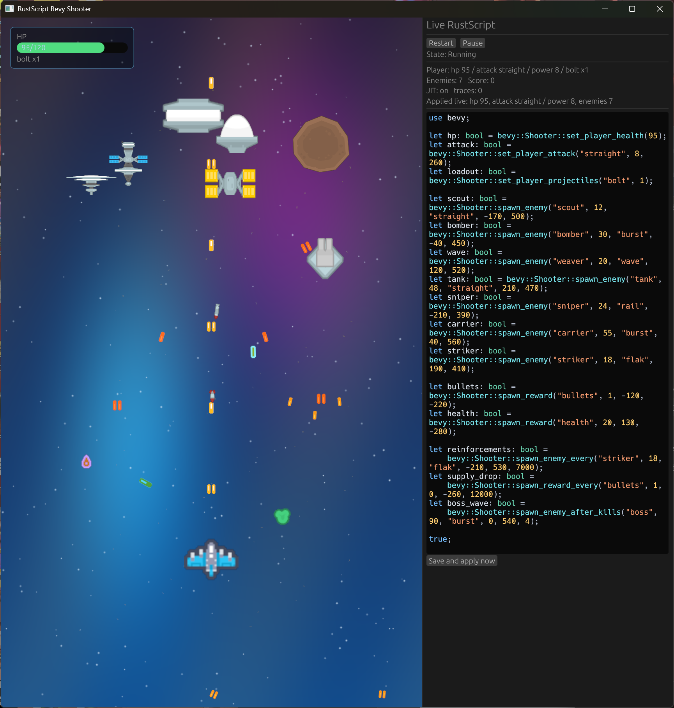
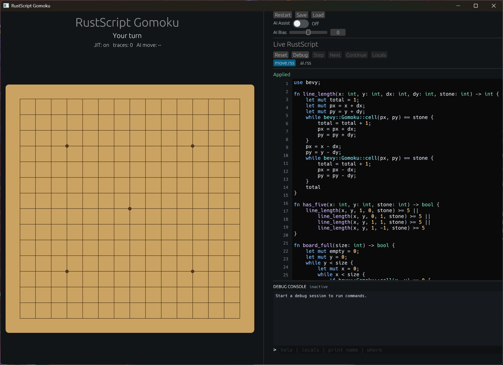
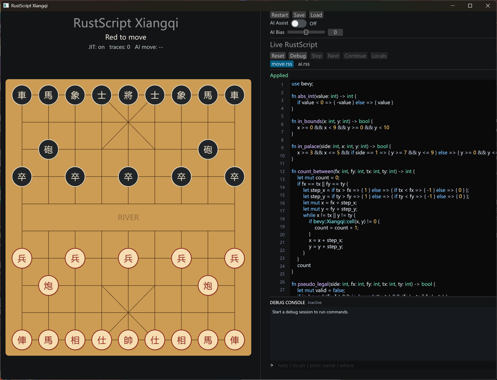

# rustscript-bevy-gameplay

Standalone Bevy integration demo for `pd-vm` / RustScript.

Play in your browser: **[RustScript Arcade](https://rustscript-lang.github.io/rustscript-bevy-gameplay/)**.

RustScript core is pinned to `805991cfc6d81e7b9d6c042a222ecf70e3f2dab0` through Git dependencies. This is the latest host-descriptor integration branch revision, compatible with the upstream gameplay migration; core master currently has a different host API. A sibling core checkout is no longer required.

## Screenshots







## What it proves

This repo demonstrates three playable Bevy examples whose gameplay rules are driven by live RustScript:

- **Shooter**: a vertical scrolling shooter with textured ships, enemy waves, rewards, player health, different projectile patterns, missiles, shockwaves, pause/restart controls, and a live script panel that can change the running world without recreating spawned entities.
- **Gomoku**: a human-vs-AI board game where move legality, win detection, and AI move selection are implemented in RustScript. The UI supports live editing, save/load of board state plus scripts, AI assist, AI bias, JIT trace telemetry, and debugger controls.
- **Xiangqi**: a Chinese chess game with board rendering, piece artwork, scripted legal-move validation, scripted AI move selection, save/load, AI assist, AI bias, JIT telemetry, and the same live debugging workflow.

Across the examples, Bevy keeps the rendering and ECS shell compiled while RustScript owns the parts that are useful to tune during development: gameplay rules, AI behavior, spawn schedules, rewards, and balancing constants. The editor can lint scripts as you type, apply changes after a short cooldown, reset to embedded defaults, pause in a debugger, step through code, inspect locals, use breakpoints, and interact through the debug console. The VM runs with JIT enabled and exposes trace counts in the game UI so script performance work is visible while playing.

Assets and scripts are embedded into the binaries, so release packages do not need external `assets/` or `scripts/` directories.

## Run

```bash
cargo test --tests
cargo run --example combat
cargo run --example shooter
cargo run --example gomoku
cargo run --example xiangqi
```

`combat` is a small headless ECS script demo. The other three examples open Bevy windows with the live RustScript editor docked on the right.

Perf-oriented AI checks are marked as ignored tests:

```bash
cargo test perf --tests -- --ignored
```

For headless smoke checks:

```bash
cargo run --example shooter -- --script-smoke
cargo run --example gomoku -- --script-smoke
cargo run --example xiangqi -- --script-smoke
```

## Web / WebAssembly

The same three Bevy examples compile to `wasm32-unknown-unknown`, with WebGL2 rendering and RustScript interpreter execution. Native builds retain Cranelift JIT. Live script editing, rule validation, AI, undo/redo, and restart are available in the browser. Board Save/Load uses local storage scoped to each game and browser origin. The thread-based debugger requires a native build.

Prerequisites: Rust, Python 3.11+, and a `wasm-bindgen-cli` version matching `wasm-bindgen` in `Cargo.lock` (currently `0.2.126`).

```bash
rustup target add wasm32-unknown-unknown
cargo install wasm-bindgen-cli --version 0.2.126 --locked
python tools/build_web.py
python -m http.server 8000 --directory dist/web
```

Open `http://localhost:8000`. Use a desktop browser with WebGL2 enabled. Each game has loading progress, retry, fit-to-window, original-size, and fullscreen controls. Shooter uses WASD or arrow keys and fires automatically. Board games use pointer input. AI executes synchronously, so a complex move can briefly delay rendering in interpreter mode.

The `Pages` workflow builds all three examples and deploys `dist/web` on pushes to `master`, or through manual dispatch. Configure the repository's Pages source as **GitHub Actions**. All resource URLs are relative so the site works under the repository's Pages subpath.

Xiangqi embeds a small Noto Sans CJK subset for its Chinese labels. The font is licensed under SIL OFL 1.1; see `assets/fonts/LICENSE.txt`.
